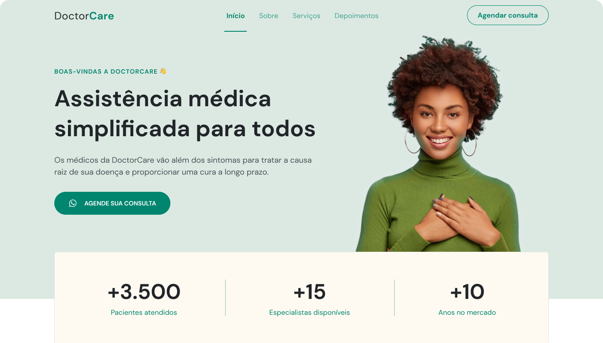

<h1 align="center"> Beauty Salon </h1>

  

## 🚀 Technologies

This project was developed with the following technologies:

- HTML e CSS
- JavaScript
- Git e Github
- Figma

## 💻 Projeto

DoctorCare is a mock web page for a health center.

- [Acesse o projeto finalizado, online](https://arthurfamaral95.github.io/DoctorCare/)

## 🔖 Layout

You can check the project layout through [THIS LINK](<https://www.figma.com/file/2Ye05RRL036sFbzvgnrVLA/DoctorCare-(Community)-(Copy)?node-id=1730%3A1076&mode=dev>). It is necessary to have a [Figma](https://figma.com) account to acess it.
